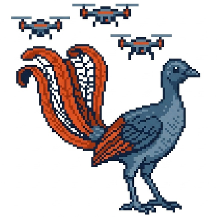

<div align="center">
    

<picture>
<source media="(prefers-color-scheme: dark)" srcset="docs/images/lyrebird-wordmark-dark.svg">

</picture>

**DJI drones speaking [MAVLink 2](https://mavlink.io/en/) like a [PX4](https://px4.io/), working seamlessly with [QGroundControl](https://github.com/mavlink/qgroundcontrol) — lightweight multi-drone control and telemetry**

[](LICENSE)
[](https://github.com/SDU-UAS-Center/lyrebird/actions/workflows/ci.yml)
[](https://SDU-UAS-Center.github.io/lyrebird/)
[](https://developer.dji.com/doc/mobile-sdk-tutorial/en/)
[](https://docs.ros.org/en/humble/)
[](https://github.com/WildDrone/WildBridge)

*A continuation of [WildBridge](https://github.com/WildDrone/WildBridge).*

</div>

---

> **Development status:** Lyrebird is already usable for development, research, and field testing,
> but the project is still evolving. Interfaces, configuration, and supported hardware may change
> before the first release. The first tagged release will be the stable reference version for
> users who need a fixed, supported baseline.

## What is Lyrebird?

Lyrebird is an **open-source ground-control solution for DJI drones**, not just an app: a lightweight Android service (Kotlin, DJI Mobile SDK V5) that runs on the RC's Android system — built into controllers like the RC Pro and RC Plus, or on a phone connected to a non-smart controller like the RC-N3 — turning it into a networked drone server, paired with optional tooling built on the same wires — a Python **GroundStation** client and **ROS 2** packages (mainly useful for bridging MAVLink/HTTP into a local ROS 2 graph for robotics applications), and a Docker **MediaMTX + browser dashboard** stack for multi-drone video and telemetry (mainly useful for fanning one drone's video out to several viewers). Nothing here is required — a custom application can talk MAVLink or HTTP straight to the aircraft, or pull DJI's own RTSP feed straight from the phone, with no ground station in the loop at all. Telemetry, commands, and live video leave the aircraft over standard, open protocols, and both control surfaces are **on by default**: **MAVLink 2** — the lightweight wire QGroundControl, MAVSDK, and PX4-oriented tooling already speak — and **HTTP + TCP** alongside it, kept both for compatibility with ground stations built against this project's predecessor, [WildBridge](https://github.com/WildDrone/WildBridge), and as the API for what MAVLink doesn't yet cover (media download, AI detections, live settings). Pick either, or use both — any ground station, in any language, can fly a DJI drone without touching DJI's proprietary SDK. Lyrebird is a renamed continuation of WildBridge, which was part of the WildDrone project.


## Why "Lyrebird"?

The lyrebird is Australia's most famous mimic — it can reproduce almost any sound with uncanny accuracy, from other birds' calls to camera shutters, chainsaws, and car alarms, well enough to fool the animals (and people) listening ([hear it for yourself](https://www.youtube.com/watch?v=AwxvjrbEkTg)). That's exactly what this project does for a DJI drone: it doesn't change the aircraft, it teaches it to speak MAVLink convincingly enough that QGroundControl, MAVSDK, or any standard ground control station can't tell the difference — down to reporting itself as a PX4 vehicle, so a ground station, swarm coordinator, or research pipeline built for a PX4 fleet can fly a DJI aircraft alongside genuine PX4 vehicles in the same swarm, unmodified. See [why that works](https://SDU-UAS-Center.github.io/lyrebird/mavlink/#why-it-looks-like-px4-to-qgroundcontrol).

## Key features

- 🛰️ **MAVLink 2 on by default, reporting as PX4** — every aircraft is a full MAVLink 2 vehicle from boot: QGroundControl, MAVSDK, and `pymavlink` connect and fly it, Fly View and Plan view both light up, no plugin or fleet-specific handling required
- ✈️ **Full QGroundControl mission support** — build a plan in QGC and Lyrebird flies it: take-off, land/RTL, speed, heading, camera, gimbal and region-of-interest items are all translated, either onto Lyrebird's own PID sequencer or DJI's native wayline engine. [How it works](https://SDU-UAS-Center.github.io/lyrebird/missions/)
- 🌐 **HTTP + TCP alongside it, also on by default** — REST commands and streaming JSON telemetry, kept for compatibility with WildBridge-era ground stations, as the API for what MAVLink doesn't cover yet (AI detections, live settings), and as the fast path for big transfers: HTTP saturates the Wi-Fi link for media and video, where MAVLink FTP stays deliberately slow and lightweight so it doesn't crowd the radio spectrum a whole swarm depends on
- 🎥 **A complete video & dashboard pipeline, not just an SDK** — WHIP/WHEP through MediaMTX plus a browser dashboard for multi-drone video, telemetry, health, and settings
- 🛡️ **Two-computer safety** — a Safety Computer can seize command authority at any time, and only it can hand control back
- 🤖 **ROS 2 ready, PX4-style topics** — `fmu/in`/`fmu/out` topics per drone, the same shape PX4 developers already know, with dynamic namespaces, zero-config auto-discovery, and one YAML file to set transport, MAVLink ports, and per-aircraft settings fleet-wide
- 🔥 **Enterprise sensors** — thermal capture and temperature, laser rangefinder, payload drop
- 🧭 **Mission-proven** — zebra-herd monitoring, wildfire detection (XPRIZE Wildfire finalist), wind-field profiling

## Supported hardware

DJI Mini 3 / Mini 4 Pro · Mavic 3 Enterprise · Matrice 30 / 300 RTK / 350 RTK / 4 Thermal — flown from the DJI RC Pro, RC Plus, or RC-N3.
[Full list](https://developer.dji.com/doc/mobile-sdk-tutorial/en/)

## In the field

Lyrebird has been used in the following research applications (Rolland et al., RiTA 2025):

| Study | UAVs | Features | Video |
|-------|------|----------|-------|
| Drone Swarm for Wildlife Monitoring | 2× Mini 3, 1× M3E | Telemetry, video, waypoints | [▶ Watch](https://www.youtube.com/watch?v=PzHnbgxLaSU) |
| Drone Swarm for Wildfire Detection | 1× M3E, 1× M4T, 2× M300 | Thermal detection, coordinated take-off, payload drop; XPRIZE Wildfire finalist | [▶ Watch](https://www.youtube.com/watch?v=F73VcUoOzo8) |
| Atmospheric Wind Field Profiling | 3× Mini 3 | Vertical wind profiles validated against LiDAR | [▶ Watch](https://www.youtube.com/watch?v=KZ40L-y1xt8) |
| Custom PID Position Controller | — | On-device PID controller | [▶ Watch](https://www.youtube.com/watch?v=j52ovMPVt_I) |

## Documentation

The full manual — quick start, MAVLink 2, HTTP API, telemetry, ROS 2, and field-test procedures — lives at [SDU-UAS-Center.github.io/lyrebird](https://SDU-UAS-Center.github.io/lyrebird/).

## Quick start

```bash
git clone https://github.com/SDU-UAS-Center/lyrebird.git && cd lyrebird
pip install -e GroundStation/Python            # Python ground-station client
```

For the Android app, open `LyrebirdApp/android-sdk-v5-as` in Android Studio, copy `local.properties.example` to `local.properties` (set `sdk.dir` and `AIRCRAFT_API_KEY`), build the `current` variant, and install it on the RC. The servers start automatically on launch.

**Next:** follow the [Getting Started guide](https://SDU-UAS-Center.github.io/lyrebird/getting-started/) to connect your first ground station.

---

## Funding

This work was supported by Innovation Fund Denmark (DIREC U07 –PERSIST), the Independent Research Fund Denmark (Grant 10.46540/4264-00105B – NAMUR), and the EU Horizon Europe WildDrone Project (MarieSkłodowska-Curie Grant No. 101071224). 
(PDF) Swarm-Steward: Scalable and Reliable Natural-Language Coordination of Autonomous Aerial and Ground Robots.

## Citation

```bash
@inproceedings{JaraboPenas2026SwarmSteward,
  author    = {Alejandro Jarabo-Pe{\~n}as and Juan Bravo-Arrabal and
               Edouard G.A. Rolland and Anders L. Christensen},
  title     = {{Swarm-Steward}: Scalable and Reliable Natural-Language
               Coordination of Autonomous Aerial and Ground Robots},
  booktitle = {Proceedings of the 2026 International Conference on
               Unmanned Aircraft Systems (ICUAS)},
  year      = {2026},
  month     = {June},
  pages     = {796--804},
  publisher = {IEEE},
  address   = {Corfu, Greece},
  doi       = {10.1109/ICUAS69441.2026.11598684},
  url       = {https://doi.org/10.1109/ICUAS69441.2026.11598684},
}
```

## Contributors

- [Alejandro Jarabo-Peñas](https://alejp.me)
- [Edouard Rolland](https://www.linkedin.com/in/edouardrolland/)
- [Juan Bravo-Arrabal](https://www.linkedin.com/in/juan-bravo-arrabal)
- [Patrik Pordi](https://www.linkedin.com/in/patrik-pordi)

## License

Business Source License 1.1 — see [LICENSE](LICENSE) for details. Converts to MIT on 2028-08-31.

Bug reports and feature requests: [GitHub Issues](https://github.com/SDU-UAS-Center/lyrebird/issues).
