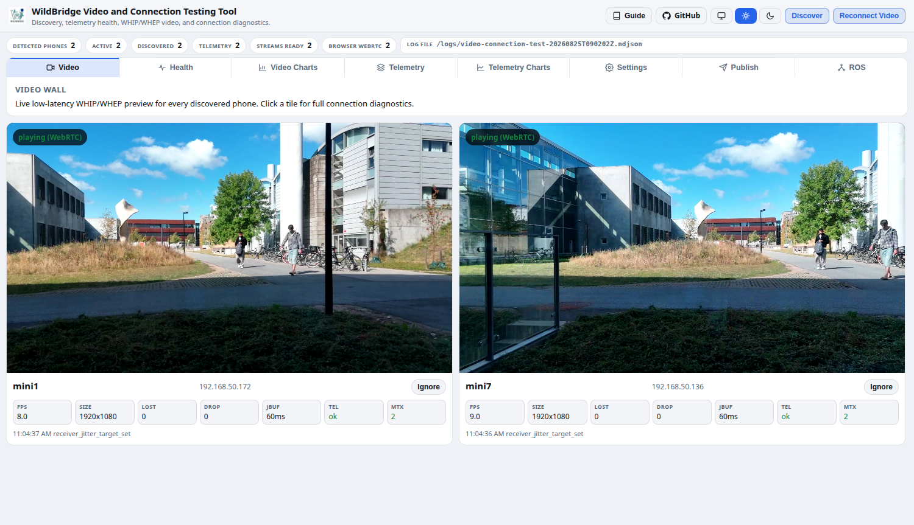

"Ground station" is everything in Lyrebird that runs *off* the aircraft and talks to it — as opposed to the [Android App](/android-app/), which runs on the RC itself. This page covers the two pieces of it that ship in this repo: the Python `DJIInterface` client, and the MediaMTX/browser dashboard used for multi-drone video and telemetry testing. The ROS 2 packages are the third piece of the ground station and get their own page — see [ROS 2](/ros/).

Every ground station, regardless of language, reaches the aircraft over the same two wires the [Android App](/android-app/) exposes: MAVLink 2 and HTTP + TCP, both on by default. The Python client is where that choice is most visible, so it's worth understanding before looking at the client itself.

## Do you need a ground station at all?

Not necessarily. Everything on this page is optional tooling built on top of the same two wires the app already exposes directly — it is not an intermediary a custom application has to go through. A robotics application can talk MAVLink or HTTP straight to the aircraft itself, exactly the way it would talk to a real PX4 vehicle or a bare HTTP API: read telemetry, send `MAV_CMD`s or `POST /send/...` calls, no ground-station process sitting in between. See [MAVLink 2](/mavlink/) or [HTTP API](/http-api/) to do that directly.

The two pieces of this repo earn their keep for two specific, different reasons rather than as a required relay layer:

- **The Python client and the [ROS 2](/ros/) packages** are mainly valuable today as a *local translator*: they turn the aircraft's MAVLink or HTTP surface into a ROS 2 graph, which matters if the application flying the drone is already built around ROS 2 — a planner, a SLAM stack, multi-robot coordination — and would otherwise have to speak MAVLink/HTTP itself just to get into ROS. If the application isn't ROS-based, it gains nothing by going through this layer; it should talk MAVLink or HTTP to the aircraft directly instead, the same way this ROS 2 node itself does.
- **MediaMTX and the video dashboard** solve a fan-out and protocol-translation problem for video specifically — see [Why MediaMTX?](#why-mediamtx) below. Watching or consuming video directly from the phone, with no MediaMTX involved, is also a legitimate option.

## Choosing a transport

The `DJIInterface` class (and everything built on it — the ROS nodes, the safety wrapper, the video dashboard) reads one environment variable, `LB_TRANSPORT`, to decide which wire to use. It can also be passed explicitly as `transport=` to the constructor, which is what a test or a script pinning a specific behavior should do instead of relying on the environment.

| `LB_TRANSPORT` | Telemetry from | Commands | When to use it |
|---|---|---|---|
| `both` *(default)* | MAVLink | MAVLink where it has an equivalent, HTTP where it doesn't | The normal choice: MAVLink is the lighter wire, so it carries as much as it can, and HTTP transparently fills the gaps (media download, settings the MAVLink surface doesn't expose yet). See [why HTTP still exists](/mavlink/#why-bulk-media-stays-on-http). |
| `mavlink` | MAVLink | MAVLink only — an endpoint with no MAVLink form is **refused, not silently retried over HTTP** | Verifying MAVLink parity itself: a silent HTTP fallback would hide exactly the gap you're trying to measure. |
| `http` | TCP telemetry stream | HTTP | Talking to an aircraft with MAVLink disabled, or a ground station that predates MAVLink support entirely (WildBridge-era compatibility). |

Two related environment variables matter once MAVLink is in play:

| Variable | Default | Meaning |
|---|---|---|
| `LB_MAVLINK_PORT` | `14550` | UDP port *this* ground station listens on. The fleet ROS manager uses one shared value for all aircraft; give a second ground station on the same machine (QGroundControl, say) a different port, or the two compete for the same datagrams. |
| `LB_MAVLINK_PEER_PORT` | `14550` | UDP port the *aircraft* listens on for commands. Only needs to differ from `LB_MAVLINK_PORT` when this ground station's own listen port has been moved. |
| `LB_MAVLINK_SIGNING_KEY` | *(unset)* | 64 hex characters. When set, every outbound command is MAVLink-2-signed with it, so the aircraft treats this ground station as the Safety Computer — the MAVLink equivalent of the HTTP `X-Safety-Token` header. |

## Python interface (`DJIInterface`)

`GroundStation/Python/lyrebird_groundstation/dji_client.py` provides one class that wraps every command, every telemetry field, and both wires behind the same API — a script written against `DJIInterface` doesn't change when the transport underneath it does. It runs its telemetry reader (TCP, MAVLink, or both) on a background thread and hands back thread-safe snapshots, so a caller reading telemetry never blocks on the network and never sees a half-written update.

### Installing it as a package, in another repo

`GroundStation/Python` is a real pip-installable package (`pyproject.toml`, distribution name `lyrebird-groundstation`) — it does not need to be vendored (copy-pasted) into a consuming project. Install it straight from this repo, pinned to a commit or tag:

```bash
pip install "git+https://github.com/SDU-UAS-Center/lyrebird.git@<commit-or-tag>#subdirectory=GroundStation/Python"
```

or as a `requirements.txt` / `pyproject.toml` dependency line:

```text
lyrebird-groundstation @ git+https://github.com/SDU-UAS-Center/lyrebird.git@<commit-or-tag>#subdirectory=GroundStation/Python
```

**Keeping it up to date** is then just bumping `<commit-or-tag>` and reinstalling — no manual re-diffing of a vendored copy. The ROS 2 packages ([ROS 2](/ros/)) are a separate concern: they're normal ROS 2 (`ament_python`/`ament_cmake`) packages, not pip packages, so pull them into a colcon workspace the ROS way — a [vcstool](https://github.com/dirk-thomas/vcstool) `.repos` file pinned the same way, imported with `vcs import src < lyrebird.repos`, instead of a bind-mounted or hand-copied directory.

A few things are worth knowing before reaching for it:

- **Auto-discovery** finds the aircraft's IP over UDP broadcast (port 30000) when none is given, so a script doesn't need to hardcode it.
- **Sequence-tracked commands**: a navigation call like `requestSendGoToWaypointNoseForward` returns a sequence number, and `isWaypointReached(seq)` only reports arrival for *that* command — so polling for arrival can't be fooled by a stale "reached" flag left over from a previous, superseded command.
- **The two-computer safety wrapper** lives in `lyrebird_groundstation.safety` as `DJIInterfaceSafety`, a drop-in subclass that authenticates every command as the Safety Computer instead of the Pilot. See [the safety model](/http-api/#two-computer-safety-authority) for what that authority actually does.

With that in mind, here is the same client exercising most of the surface:

```python
import time
from lyrebird_groundstation.dji_client import DJIInterface, discover_drone

# Auto-discovery via UDP broadcast (port 30000) if no IP provided
dji = DJIInterface("", discover_callback=discover_drone)

# Start background telemetry thread (TCP socket, port 8081)
dji.startTelemetryStream()

# Read latest telemetry (thread-safe, returns copy of last JSON snapshot)
print(dji.getBatteryLevel())          # int: 0–100
print(dji.getLocation())              # {'latitude': ..., 'longitude': ..., 'altitude': ...}
print(dji.getHeading())               # float: compass degrees
print(dji.getAttitude())              # {'pitch': ..., 'roll': ..., 'yaw': ...}
print(dji.getGimbalAttitude())        # {'pitch': ..., 'roll': ..., 'yaw': ...}
print(dji.getSatelliteCount())        # int
print(dji.getFlightMode())            # str: 'GPS', 'ATTI', 'VIRTUAL_STICK', 'GO_HOME', ...
print(dji.isManualOverrideActive())   # bool
print(dji.getRemainingFlightTime())   # int: seconds
print(dji.getDistanceToHome())        # float: metres
print(dji.getZoomRatio())             # float

# Commands
dji.requestSendTakeOff()
dji.requestSendLand()
dji.requestSendRTH()                  # Aborts mission first, then RTH
dji.requestSendEnableVirtualStick()
dji.requestAbortMission()             # Abort + disable Virtual Stick
dji.requestAbortDJINativeMission()    # Abort DJI native mission only

# Navigation
# Nose-forward: drone turns to face the leg, flies forward, then rotates to yaw on arrival.
dji.requestSendGoToWaypointNoseForward(49.306254, 4.593728, 20.0, yaw=90, speed=5.0)
# Hold-heading: nose stays on yaw for the whole flight (drone crabs sideways), tighter tolerance.
dji.requestSendGoToWaypointHoldHeading(49.306254, 4.593728, 20.0, yaw=90, speed=5.0)
dji.requestSendNavigateTrajectoryDJINative(
    [(49.306, 4.593, 20), (49.307, 4.594, 25), (49.308, 4.595, 20)], speed=10.0)
dji.requestSendGotoYaw(45.0)
dji.requestSendGotoAltitude(30.0)

# Camera / gimbal
dji.requestSendGimbalPitch(-30.0)
dji.requestSendGimbalYaw(45.0)
dji.requestSendGimbalRelPitch(-5.0)     # relative to the current angle
dji.requestSendGimbalRelYaw(10.0)
dji.requestSendZoomRatio(4.0)
dji.requestCameraStartRecording()
dji.requestCameraStopRecording()

# Thermal / payload
dji.requestCapture()                     # capture descriptor for the thermal lens
dji.requestCaptureTemperature()          # thermal max temperature
dji.requestLRFMeasure()                  # distance + geo-referenced target + laser state
dji.getLRFTarget()                       # last locked target from telemetry
dji.requestDrop()                        # release payload (airframes with a drop port)

# Media
files = dji.listMedia()                  # [{"name", "index", "size", "type"}, ...]
dji.downloadByName(files[0]["name"], out_dir="./media")

# Sequence-tracked commands — avoids acting on a stale reach flag
seq = dji.requestSendGoToWaypointNoseForward(49.306254, 4.593728, 20.0, yaw=90, speed=5.0)
while not dji.isWaypointReached(seq):
    time.sleep(0.1)

# Preflight
dji.isReadyToTakeoff()
dji.getTakeoffBlockReason()

# Manual override
dji.requestDeactivateManualOverride()

# RTH altitude
dji.requestSetRTHAltitude(50.0)

# Virtual stick (raw AVS, values saturated to ±0.3 by DJIInterface)
dji.requestSendStick(leftX=0, leftY=0.2, rightX=0.1, rightY=0)

dji.stopTelemetryStream()
```

The two-computer safety wrapper lives in `lyrebird_groundstation.safety` — see [HTTP API](/http-api/#two-computer-safety-authority).

## Why MediaMTX?

The app always has a video feed available directly, with no ground station involved: DJI's SDK runs an always-on RTSP server on the phone itself, pulled by anything that connects to `rtsp://<phone-ip>:8554/streaming/live/1` — no in-app configuration needed. `lyrebird_videofeed`, the ROS 2 video node covered on the [ROS 2](/ros/) page, is a working example of exactly that: it connects straight to the phone's own RTSP stream and republishes it as a ROS topic, no MediaMTX in the path at all.

MediaMTX earns its place for two problems that direct connection doesn't solve:

- **Fan-out.** DJI's RTSP server (and the app's WHIP publish target) is built to serve a small number of direct connections well, not an arbitrary number of viewers. Every extra client connecting straight to the phone adds encode/network load *on the phone*, on the same Wi-Fi link the flight controller depends on. Point the aircraft at MediaMTX once — one WHIP publish — and any number of WHEP subscribers watch the relay instead, without the phone or the network even knowing there is more than one viewer.
- **Protocol translation.** The app publishes one way in (WHIP); MediaMTX serves it back out however the consumer wants it — WHEP for a browser, RTSP or RTMP for something that only speaks those — without the app needing to support every protocol every consumer might want.

Both are conveniences, not requirements: connecting straight to the phone works whether that means pulling DJI's native RTSP stream as above, or a custom application pushing WHIP directly and consuming it itself with no relay in between.

**The WHIP path is also, underneath, a workaround for DJI's own streaming being slow — not DJI tooling itself.** RTSP push, RTMP, Agora, GB28181, and the always-on RTSP pull server all run through DJI's own internal live-streaming implementation end to end: the SDK owns the encode, the mux, and the network transport, and none of that is something this app controls or can speed up — that internal pipeline is what the up-to-10-second latency actually comes from, on every one of those paths, not anything specific to RTSP as a protocol.

WHIP sidesteps that pipeline entirely instead of asking DJI to send it faster. `DJIV5VideoCapturer` pulls **raw decoded YUV frames** straight off `ICameraStreamManager.addFrameListener` — the same low-level live-view frame callback DJI's own preview `SurfaceView` uses, not the streaming/broadcast API RTSP-push and friends are built on — and hands each frame directly to Lyrebird's own WebRTC stack (`WhipPublisher`, using Google's `libwebrtc`), which does its own H.264 encoding and its own network transport over RTP straight to MediaMTX. None of DJI's streaming code runs in this path at all.

That is also exactly why latency stays low and bounded rather than creeping up: RTP is a real-time transport with no muxed-container buffering to accumulate delay in, and `AdaptiveFrameRatePolicy` actively watches for the encoder or network falling behind and steps the frame rate down (30 → 25 → 20 → … → 5 fps) to relieve it, rather than letting frames queue up. The tradeoff from field testing is exactly that: usually under a second end to end, at the cost of occasionally dropping to a lower frame rate instead of the several-second creep RTSP/RTMP/Agora/GB28181 all show.

### The optional surface-H264 encoder

WHIP has two encoder choices on the Android side. The transport and relay are the same in both cases; only the path that produces H264 changes:

| WHIP encoder | Camera-to-encoder path | Best for |
|---|---|---|
| Standard WebRTC encoder (default) | DJI `addFrameListener` -> raw NV21/YUV -> Lyrebird crop/scale -> libwebrtc H264 | The reliable fallback, phone-side detection, and devices where surface encoding is untested |
| DJI surface H264 (experimental) | DJI `putCameraStreamSurface` -> MediaCodec `COLOR_FormatSurface` -> hardware H264 -> WebRTC `EncodedImage` | Reducing CPU-side pixel conversion and keeping the camera path closer to native resolution |

The experimental choice is controlled by the Android preference `lb_whip_surface_h264_encoder` and by the Surface H264 toggle in the app's Stream / WebRTC settings. It is false by default in a fresh installation and requires an app restart after changing. It is an encoder switch, not a different public URL: the publish endpoint remains `http://<ground-station-ip>:8889/<drone_name>/whip`, and viewers still use the matching WHEP endpoint.

The surface path creates an Android `MediaCodec` H264 encoder input surface and hands that surface to DJI's camera stream manager. DJI writes camera frames directly into the encoder surface, so the app avoids the normal CPU NV21 conversion, crop, and scale work. The compressed output is drained asynchronously and passed into WebRTC as `EncodedImage`; a small synthetic WebRTC driver supplies cadence calls because the real pixels arrive asynchronously through MediaCodec rather than through `onFrameCaptured`.

Several details make the handoff usable rather than merely fast:

- SPS/PPS codec configuration is retained and prepended to keyframes so a new MediaMTX/WHEP decoder can initialise correctly.
- MediaCodec output bytes are copied before the codec buffer is released. The handoff is zero-copy on the camera-to-encoder input path, but not on the compressed output path.
- Presentation timestamps from MediaCodec are carried into WebRTC capture timestamps.
- A bounded output queue detects pressure. When it overflows, dependent delta frames are discarded, a sync frame is requested, and delivery resumes from the next keyframe instead of continuing with a broken H264 reference chain.
- Surface-source metrics are forwarded into the same dashboard telemetry as the standard path, including FPS, bitrate, quality limitation, unsent encoded frames, and recovery count.

This addresses the prototype failure modes: dropping compressed delta frames caused blur and jumps until a decoder reference was refreshed, holding MediaCodec buffers produced black video, and waiting for a conventional first capturer frame could stall startup. The surface path avoids those specific problems, but remains experimental because MediaCodec behaviour and DJI surface/listener coexistence need validation on each aircraft and Android controller. If a device produces black video, stalls, or shows repeated recovery, disable the preference and restart to return to the standard libwebrtc encoder.

## GroundStation video dashboard

Flying more than one aircraft at once raises a question a single Python script doesn't answer well: is every drone's video actually healthy, and if one isn't, is the problem the phone, the network, MediaMTX, or the browser watching it? The video dashboard exists to answer that at a glance across a whole fleet, rather than one drone at a time from the command line. Under the hood it's the same building blocks as everything else on this page — MediaMTX for WHIP/WHEP video, and the TCP telemetry stream (or MAVLink) for state — packaged as a Docker stack with a browser front end: it discovers phones on the network automatically, connects to each one's telemetry, tracks stream health continuously, and plays every feed back through WHEP.

Default services:

| Service | Default URL / Port |
|---------|--------------------|
| Browser dashboard | http://localhost:8090 |
| MediaMTX WebRTC / WHIP / WHEP | http://localhost:8889 |
| MediaMTX API | http://localhost:9997 |
| MediaMTX RTSP | rtsp://localhost:8554 |
| ICE UDP | :8189 |

Useful restart command:

```bash
docker compose -f GroundStation/video_test/compose.yaml down
docker compose -f GroundStation/video_test/compose.yaml up -d
docker compose -f GroundStation/video_test/compose.yaml ps
```

Runtime diagnostics are written under `GroundStation/video_test/logs/`. Those logs are intentionally ignored by git.

Settings can be viewed and changed for each drone from the **Settings** tab: it reads and writes DJI flight limits (RTH altitude, max height/distance), RC pairing and stick mode, and app/video settings over HTTP, and shows read-only rows for the drone name, the detected aircraft model, and the [control profile](/android-app/#control-profiles) (speed/PID/gimbal profile) automatically selected for it — so you can confirm the right profile is active without opening the app on the phone.

| Tab | What it shows |
|-----|---------------|
| **Video** | Live WHIP/WHEP tiles per drone with quick FPS/loss/telemetry stats |
| **Health** | Correlated phone/sender/MediaMTX/browser diagnostics, worst symptom first |
| **Video Charts** | Decoded FPS, bitrate, packet loss, and jitter over time |
| **Telemetry** | Full nested live state tree per drone |
| **Telemetry Charts** | Battery, satellites, altitude, and Wi-Fi RSSI over time |
| **Settings** | View and change DJI/app settings per drone over HTTP |
| **HTTP** | The full `/send/` catalogue, each entry marked if it also has a MAVLink form |
| **MAVLink** | What the aircraft reports and accepts as a MAVLink 2 vehicle, with an HTTP cross-check |
| **ROS** | Per-drone ROS topic liveness and rates from ros-monitor |



## Next steps

- Browse every command and status endpoint: [HTTP API](/http-api/).
- Fly from QGroundControl or MAVSDK instead: [MAVLink 2](/mavlink/).
- Feed a ROS 2 graph from the same aircraft: [ROS 2](/ros/).
- See what runs on the aircraft side of this connection: [Android App](/android-app/).
- Verify all of this against a real aircraft: [Field Test](/field-test/).
