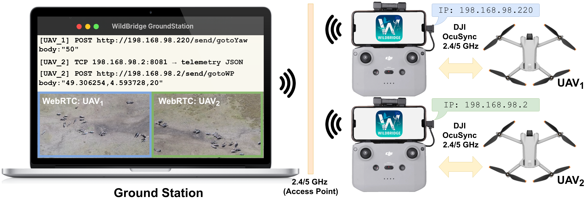

import { Card, CardGrid, LinkCard } from '@astrojs/starlight/components';

Lyrebird is an open-source ground-control solution for DJI drones: a lightweight Android app (Kotlin, DJI Mobile SDK V5) that runs on the RC's Android system — built into controllers like the RC Pro and RC Plus, or on a phone connected to a non-smart controller like the RC-N3 — paired with a Python GroundStation client, ROS 2 packages, and a MediaMTX/dashboard video stack. Every aircraft speaks **MAVLink 2** by default — the lightweight wire QGroundControl, MAVSDK, and pymavlink already know — alongside **HTTP + TCP**, also on by default, kept for compatibility with this project's predecessor WildBridge and as the API for what MAVLink doesn't cover (media, AI detections, live settings). Pick either, or use both — no DJI SDK required.

*Multi-drone setup: each RC runs Lyrebird and exposes a MAVLink 2 vehicle (UDP 14550), HTTP commands (port 8080), TCP telemetry (port 8081), discovery, and WHIP/WHEP video publishing through MediaMTX.*

## Explore the docs

<CardGrid stagger>
	<LinkCard
		title="Getting Started"
		description="Install the app on your RC, build from source, and connect your first ground station."
		href={`${import.meta.env.BASE_URL}getting-started/`}
	/>
	<LinkCard
		title="Android App"
		description="Everything the Android app (on the RC or a connected phone) can do, and how to build, install, and run it."
		href={`${import.meta.env.BASE_URL}android-app/`}
	/>
	<LinkCard
		title="Ground Station"
		description="The Python interface (DJIInterface) and the multi-drone video dashboard."
		href={`${import.meta.env.BASE_URL}groundstation/`}
	/>
	<LinkCard
		title="MAVLink 2"
		description="Fly Lyrebird drones from QGroundControl, MAVSDK, or pymavlink — no plugin."
		href={`${import.meta.env.BASE_URL}mavlink/`}
	/>
	<LinkCard
		title="HTTP API"
		description="Every control and status endpoint on port 8080, including the two-computer safety model."
		href={`${import.meta.env.BASE_URL}http-api/`}
	/>
	<LinkCard
		title="Telemetry"
		description="The newline-delimited JSON stream on port 8081, field by field."
		href={`${import.meta.env.BASE_URL}telemetry/`}
	/>
	<LinkCard
		title="ROS 2"
		description="PX4-style fmu/in/fmu/out topics per drone under dynamic namespaces, with auto-discovery launch files."
		href={`${import.meta.env.BASE_URL}ros/`}
	/>
	<LinkCard
		title="Logs & Troubleshooting"
		description="Flight logging locations, common connection issues, and the project layout."
		href={`${import.meta.env.BASE_URL}operations/`}
	/>
	<LinkCard
		title="Field Test"
		description="The procedure for verifying the MAVLink implementation against a real aircraft."
		href={`${import.meta.env.BASE_URL}field-test/`}
	/>
</CardGrid>

## Why Lyrebird?

<CardGrid stagger>
	<Card title="MAVLink 2 by default, HTTP alongside it" icon="server">
		Every aircraft is a full MAVLink 2 vehicle from boot — QGroundControl, MAVSDK, and pymavlink connect with no plugin. HTTP + TCP run alongside it, also on by default, for WildBridge compatibility and for what MAVLink doesn't cover yet.
	</Card>
	<Card title="A complete ground segment, but never a required one" icon="window">
		Not just an RC app: a Python GroundStation client, PX4-style ROS 2 packages, and a MediaMTX-backed multi-drone video and telemetry dashboard — all optional tooling on top of the same MAVLink/HTTP wires a custom application can talk to directly.
	</Card>
	<Card title="Multi-drone by design" icon="rocket">
		Several aircraft coexist on one LAN. Auto-discovery finds each drone, and ROS namespaces follow the drone's own name.
	</Card>
	<Card title="Two-computer safety" icon="setting">
		A Safety Computer can seize command authority from the Pilot Computer at any time, and only it can hand control back.
	</Card>
	<Card title="Mission-proven" icon="open-book">
		Zebra herd monitoring, wildfire detection (XPRIZE Wildfire finalist), and wind-field profiling.
	</Card>
</CardGrid>
